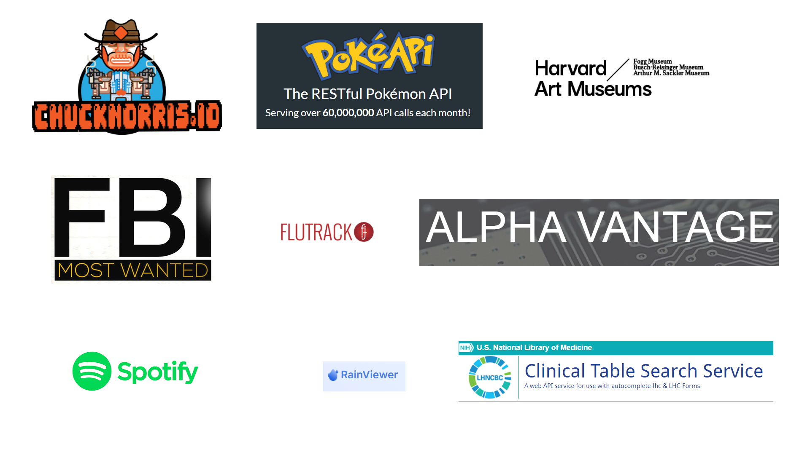
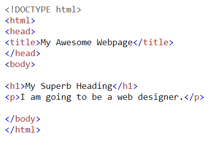
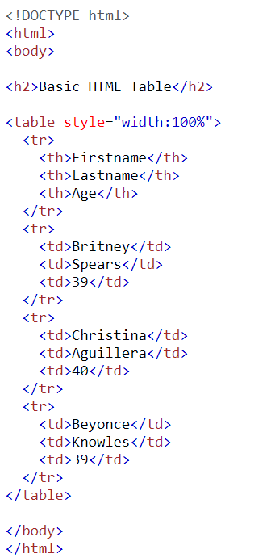
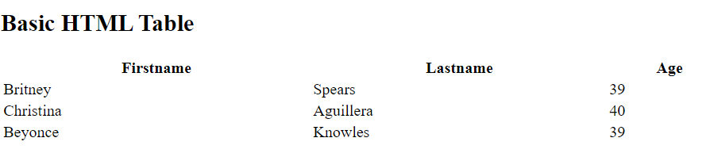
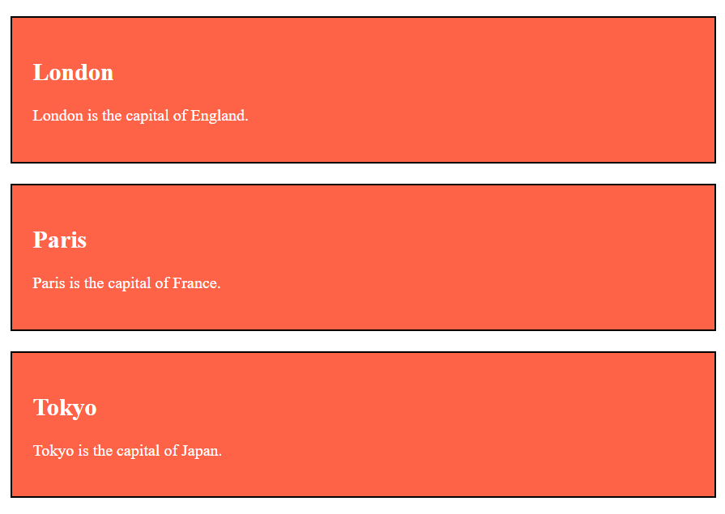
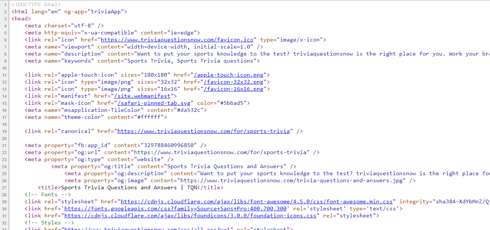
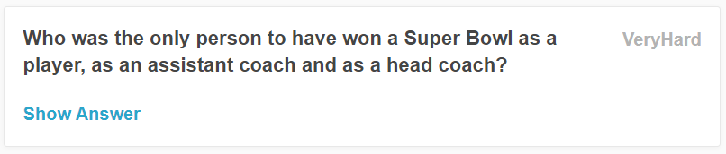
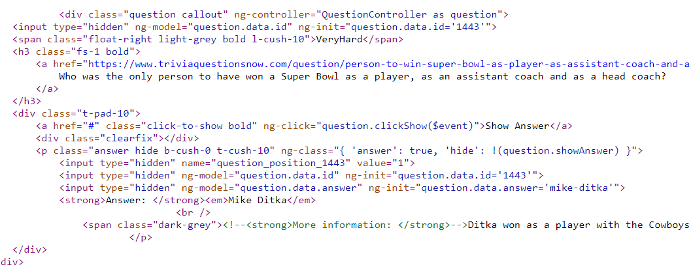
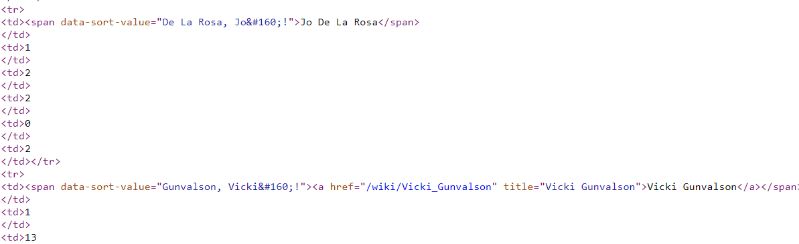

class: logo-slide

---

class: title-slide

## Intro to Web Scraping

### Applications of Data Science - Class Bonus

### Giora Simchoni

#### `gsimchoni@gmail.com and add #dsapps in subject`

### Stat. and OR Department, TAU
### `r Sys.Date()`

---
```{r child = "../setup.Rmd"}
```

```{r packages, echo=FALSE, message=FALSE, warning=FALSE}
library(tidyverse)
```

class: section-slide

# The Three Rules of Web Scraping

---

### Rule 1: Do you *really* need web scraping?

There are data APIs for just about anything, you know...



---

#### R API Packages

Many of them already accessible with a R/Python package...

```{r, eval=FALSE}
library(wbstats)

female_labor <- wb_data(
  indicator = c("women_lab_share" = "SL.TLF.TOTL.FE.ZS"),
  start_date = 1990,
  end_date = 2020
)

female_labor %>%
  filter(country %in% c("Israel", "United States")) %>%
  ggplot(aes(date, women_lab_share, color = country)) +
  geom_line(lwd = 2) +
  labs(title = "Share of women in labor force") +
  theme_light() +
  theme(text = element_text(size=16))
```

.font80percent[
From: https://cfss.uchicago.edu/notes/application-program-interface/
]
---

```{r WB-Stats, fig.asp=0.7, out.width="100%", warning=FALSE, message=FALSE, echo=FALSE}
female_labor <- read_csv("../data/female_labor_wbstats.csv")

female_labor %>%
  filter(country %in% c("Israel", "United States")) %>%
  ggplot(aes(date, women_lab_share, color = country)) +
  geom_line(lwd = 2) +
  labs(title = "% of women in labor force", x = "", y = "") +
  theme_light() +
  theme(text = element_text(size=16))
```

---

#### The `datapasta` package

My gift to you.

<div class = "no_shadow">
  <p align="center">
    
  </p>
</div>

---


### Rule 2: Learn some HTML first!

HTML is a set (or tree) of *elements*, marked by *HTML tags*:

.pull-left[

]

.pull-right[

]

- First children in the tree: `header` and `body`
- View any page's HTML (on chrome) with right-click and "View page source" (or Ctrl + U)

---

#### Useful elements and attributes to know

- `<p>` for paragraph `</p>`
- `<h1>` for headings `</h1>`
- `<br>`, `<hr>` for breaks
- `<a href = "http://www.google.com>` for links `</a>`
- `<b><i>` For bold, italic etc. `</i></b>`
- ``
- `<p style="color:DodgerBlue;">` for font color `</p>`

---

#### HTML Tables

A big thing when it comes to data as you can imagine...

.pull-left[

]

.pull-right[

]

---

#### HTML Classes

A class attribute is defined in a style sheet, lets you repeat a style.

.pull-left[

]

.pull-right[

]

---

### Rule 3: Be polite!

With great power comes great responsibility.

See e.g. the [polite](https://github.com/dmi3kno/polite) package.


---

class: section-slide

# rvest

---

### `read_html()`

You're now a NLP expert, and you've just developed a SOTA Q&A model. How would you demonstrate your model's performance?

How about [triviaquestionsnow.com](https://www.triviaquestionsnow.com/)?

Let's scrape a few Q&As. Politely.

```{r, message=FALSE}
library(rvest)

url <- "https://www.triviaquestionsnow.com/for/sports-trivia"

html_obj <- read_html(url)
```

`read_html()` is usually where you'd start. What did you get?

```{r}
class(html_obj)
```

---

### View page source

With time, you'll become friendly with this weird object. Right now it is better than...



---

### `html_children()` and `html_node()`

Our tree has two children: `head` and `body`

```{r}
html_obj %>% html_children()
```

Again notice the object returned might not be familiar ("`xml_nodeset`")

And each of the children has children of its own:

```{r}
html_obj %>% html_node("body") %>% html_children()
```

---

### `html_nodes()`

Usually we'd figure out a rule and want a list of all relevant nodes:

```{r}
html_obj %>% html_nodes("img")
```

```{r}
html_obj %>% html_nodes("a")
```

---

### `html_attrs()`

Getting a specific attribute from those nodes:

```{r}
html_obj %>% html_nodes("img") %>% html_attr("src")
```

```{r}
html_obj %>% html_nodes("a") %>% html_attr("href")
```

---

### `html_text()`

Getting the text from whatever set of elements we have:

```{r}
html_obj %>% html_nodes("a") %>% html_text()
```

---

### How to get to those questions? Option 1

Look at the page source, get some identifier yourself (class, ID, link)

.pull-left[

]

.pull-right[

]

```{r}
 html_obj %>% html_nodes(".question") %>% .[[1]]
```

---

After some trial and error...

```{r}
html_obj %>%
  html_nodes(".question") %>%
  html_nodes(".fs-1") %>%
  html_text() %>%
  str_trim()
```

---

### How to get to those questions? Option 2

[SelectorGadget](https://selectorgadget.com/)!

<div class = "no_shadow">
  <p align="center">
    
  </p>
</div>

---

### From here it's a function fest!

```{r}
extract_questions_and_answers_from_page <- function(url) {
  html_obj <- read_html(url)
  levels <- html_obj %>% html_nodes(".question") %>%
    html_nodes(".l-cush-10") %>% html_text()
  questions <- html_obj %>% html_nodes(".question") %>%
    html_nodes(".fs-1") %>% html_text() %>% str_trim()
  answers <- html_obj %>% html_nodes(".question") %>%
    html_nodes(".answer") %>% html_text() %>%
    str_extract(., "Answer:.*") %>% str_replace("Answer: ", "")
  tibble(level = levels, question = questions, answer = answers)
}

extract_questions_and_answers_from_page(url)
```

---

### Pagination

```{r}
create_page_url <- function(topic, page_num) {
  str_c("https://www.triviaquestionsnow.com/for/", topic, "-trivia?page=", page_num)
}

extract_multiple_pages_single_topic <- function(topic, n = 5) {
  cat(topic, "\n")
  res <- map_dfr(
    1:n,
    function(i) {
      cat(" ", i)
      url <- create_page_url(topic, i)
      extract_questions_and_answers_from_page(url)
    }
  )
  res$topic <- topic
  cat("\n")
  res
}
```

---

```{r, eval=FALSE}
extract_multiple_pages_single_topic("sports")
```

```{r, echo=FALSE} 
df_sports <- read_csv("../data/trivia_scrape_df_sports.csv", col_types =  cols())

df_sports
```

---

### Magic!

```{r, eval=FALSE}
topics <- c("sports", "kids", "science", "bible", "food-drink", "history", "geography", "video-games")

df_all <- map_dfr(
  topics,
  extract_multiple_pages_single_topic
)

df_all %>% count(topic)
```

```{r, echo=FALSE}
df_all <- read_csv("../data/trivia_scrape_df_all.csv", col_types =  cols())

df_all %>% count(topic)
```

---

class: section-slide

# BeautifulSoup

---

### Almost always start with

```{python}
import requests
from bs4 import BeautifulSoup

html_obj = requests.get('https://en.wikipedia.org/wiki/List_of_The_Real_Housewives_cast_members')

soup = BeautifulSoup(html_obj.content, 'html.parser')
type(soup)
```

This object has all sorts of attributes and methods:

```{python, eval=FALSE}
soup.get_text()
soup.prettify()
soup.attrs
soup.children
soup.title
```

---

### `find()` a tag, `find_all()`

```{python}
link_objs = soup.find_all('a', href=True)
type(link_objs)
type(link_objs[3])
link_objs[3].text
link_objs[3].attrs
```

See the actual link in the [page](https://en.wikipedia.org/wiki/List_of_The_Real_Housewives_cast_members).

---

### Getting that `table`

```{python}
table = soup.find('table', attrs={'class':'wikitable'})
table_body = table.find('tbody')

rows = table_body.find_all('tr')
len(rows)
rows[0]
```

---

### Getting a Housewife name



```{python}
import re

rows[3].find('span', attrs = {'data-sort-value': re.compile(r'.*')})
```

---

### Getting only HWives with Wiki pages

```{python}
housewives_with_links = []
for row in rows:
  housewife = row.find('span',
    attrs = {'data-sort-value': re.compile(r'.*')})
  if housewife is not None:
    link = housewife.find('a')
    if link is not None:
      housewives_with_links.append((housewife.text, link['href']))

import pandas as pd

h_df = pd.DataFrame(housewives_with_links, columns=['name', 'link'])

h_df.head()
```

---

### (Though if your table is simple, try:)

```{python}
l = pd.read_html(html_obj.text)

l[0].head()
```

---

### Following HWives Links

```{python, eval = FALSE}
def get_housewife_img_ref(housewife_link):
  html_obj = requests.get('https://en.wikipedia.org' + housewife_link)
  soup = BeautifulSoup(html_obj.content, 'html.parser')
  infobox = soup.find('table', attrs = {'class': 'vcard'})
  if infobox is not None:
    img_obj = infobox.find('img', src=True)
    if img_obj is not None:
      return img_obj['src']
  return None
  
h_df['img_ref'] = h_df['link'].apply(get_housewife_img_ref)
h_df.dropna(inplace=True)

h_df.head()
```

```{python, echo=FALSE}
df = pd.read_csv('../data/housewives.csv', usecols=[1,2,3])
df.head()
```

---

### Downloading HWives Images

```{python, eval = FALSE}
def make_img_filename(hf_name):
  return 'data/housewives/' + hf_name.lower().strip(',.-').replace(' ', '_') + '.jpg'

def download_hw_img(hf_name, hf_img_ref):
  img_file = make_img_filename(hf_name)
  img_data = requests.get('http:' + hf_img_ref).content
  with open(img_file, 'wb') as handler:
      handler.write(img_data)
      
h_df.apply(lambda row: download_hw_img(row['name'], row['img_ref']),
  axis=1)
```

