class: logo-slide

---

class: title-slide

## Intro to Building Data Apps

### Applications of Data Science - Class Bonus

### Giora Simchoni

#### `gsimchoni@gmail.com and add #dsapps in subject`

### Stat. and OR Department, TAU
### `r Sys.Date()`

---
```{r child = "../setup.Rmd"}
```

```{r packages, echo=FALSE, message=FALSE, warning=FALSE}
library(tidyverse)
library(emoji)
```

class: section-slide

# Shiny in Four Apps

---

### Shiny

Shiny is made in RStudio.

Start with the [docs](https://shiny.rstudio.com/).

Or go to Zev Ross 40 (!) apps [tutorial](http://zevross.com/blog/2016/04/19/r-powered-web-applications-with-shiny-a-tutorial-and-cheat-sheet-with-40-example-apps/).

Or straight to God Himself:


---

### shiny01

A single `app.R` file containing your frontend (`ui`) and backend (`server`):

.pull-left[
  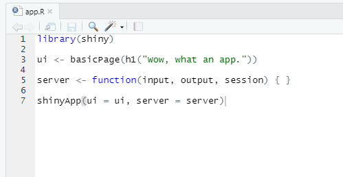
]

.pull-right[
  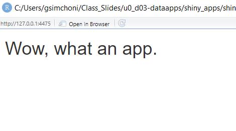
]
---

### shiny02

I recommend befriending the frontend (`ui`) first:

.pull-left[
  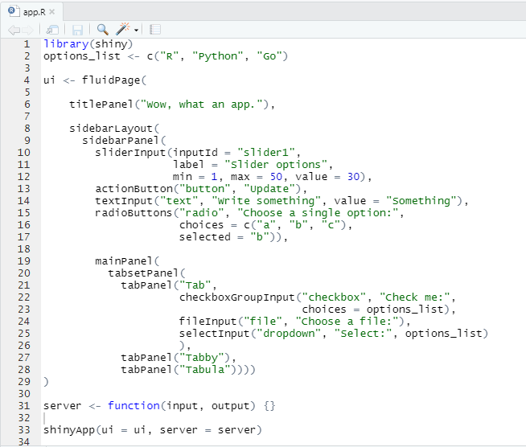
]

.pull-right[
  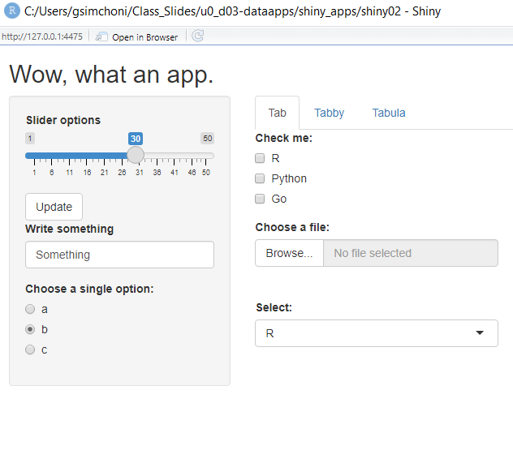
]

---

### shiny03

Once it becomes too much we go modular.

Backend (`server.R`) is where R does her thing.

`observeEvent()` of slider changing to re-render a plot:

.pull-left[
  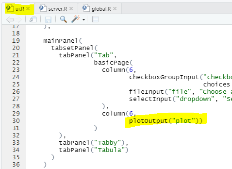
]

.pull-right[
  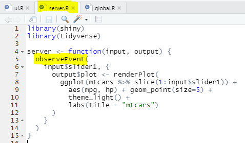
]

---

### shiny04

.pull-left[
  Use `reactiveValues()` to keep the state of dynamic objects:
  
  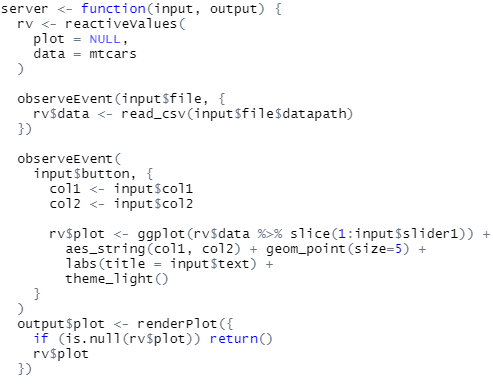
]

.pull-right[
  Use `renderUI()` for dynamic UI:
  
  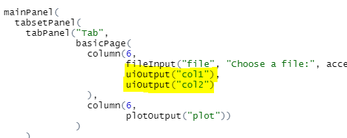
  
  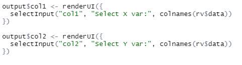
]

---

### Is that it?


---

### Formulan

<iframe src="https://gsimchoni.shinyapps.io/formulan" width="108%" height="75%", style="border:2px solid black;"></iframe>

---

### If you really want to be amazed

Visit the annual RStudio Shiny [contest](https://www.rstudio.com/blog/winners-of-the-3rd-annual-shiny-contest/) and the Shiny [gallery](https://shiny.rstudio.com/gallery/).

---

class: section-slide

# Dash in Four Apps

---

### Dash

Dash is made by Plotly, other than Python it works with R and Julia.

It is much "closer" to JavaScript (advantage?)

Start with the [docs](https://plotly.com/dash/).

Another promising option is [Voila](https://voila.readthedocs.io/en/stable/index.html) by Jupyter.

---

### dash01

A single `app.py` file containing your frontend (`layout`) and backend (`callbacks`):

.pull-left[
  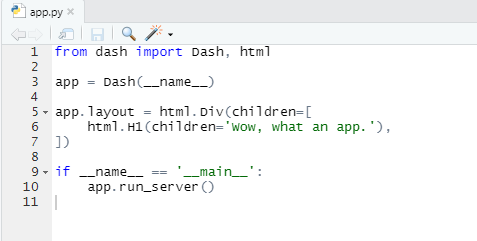
]

.pull-right[
  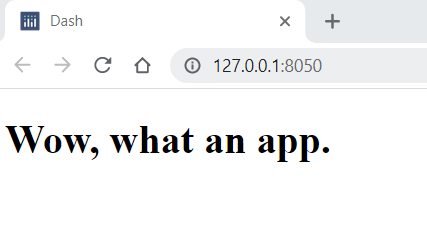
]
---

### dash02

I recommend befriending the frontend (`layout`) first:

.pull-left[
  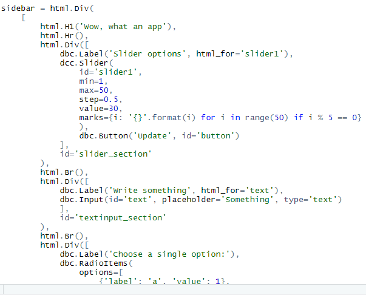
]

.pull-right[
  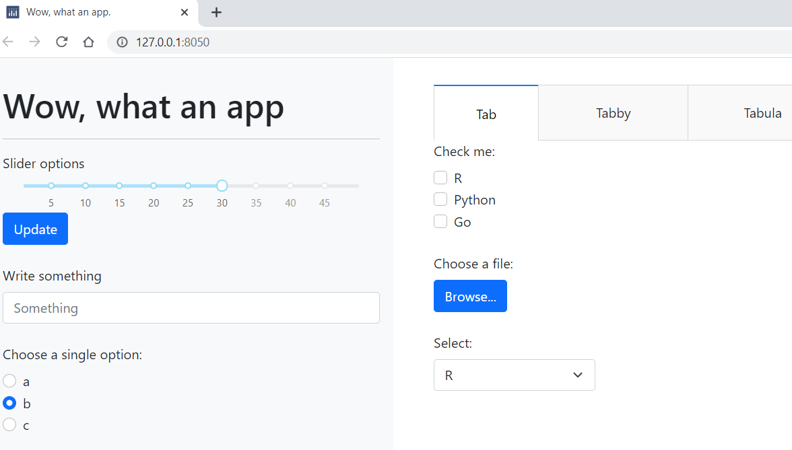
]

---

### dash03

Once it becomes too much we go modular.

Backend (`callbacks.py`) is where Python does her thing.

`@app.callback()` of slider changing to re-render a plot:

.pull-left[
  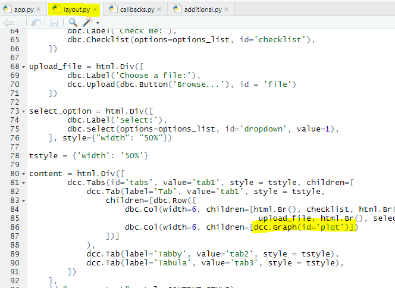
]

.pull-right[
  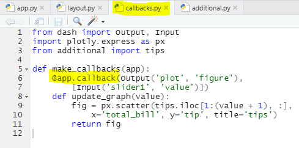
]

---

### dash04

.pull-left[
  There are no `reactiveValues` in Dash backend (AFAIK), but we can do multiple `Output`s/`Input`s and `State`s
  
  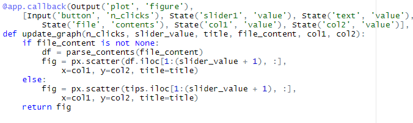
]

.pull-right[
  And rendering UI is very easy because every object's components are modifiable:
  
  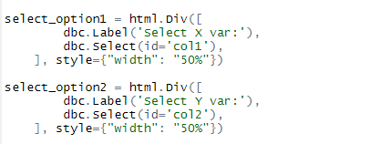
  
  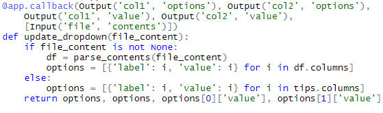
]

---

### Is that it?


---

### If you really want to be amazed

Visit the Dash [gallery](https://dash.gallery/Portal/).

---

### Summary

Do I think you can replace the Front-end engineer at your organization? No.

But you can certainly use data apps for:

* Inside dashboards (everyone can access via company server or with Docker: Vivian)
* Personal tools (RateImagesApp, Formulan)
* Quick prototypes
* Showing people in company how data/analysis looks like and letting them playing with it
* Simulations
* Model testing