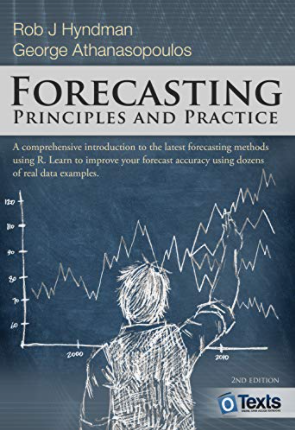
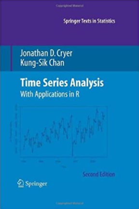
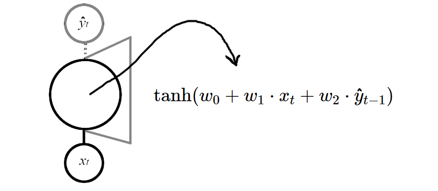
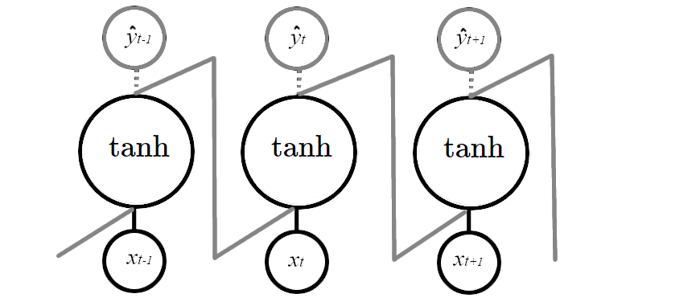
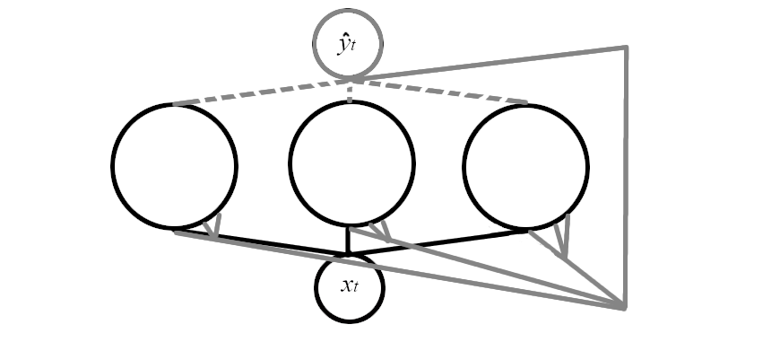
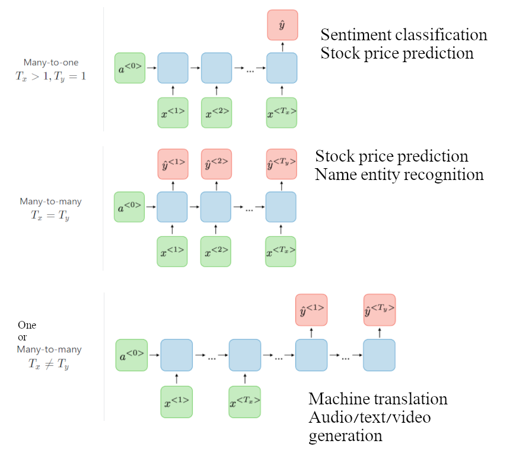
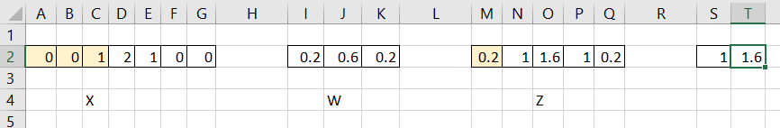
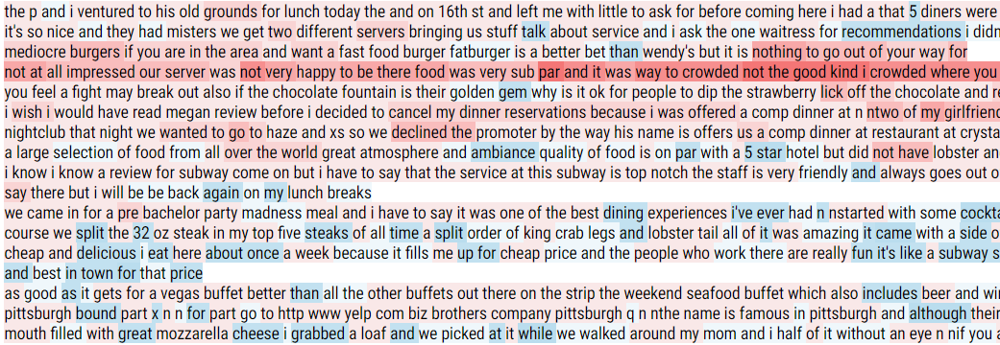
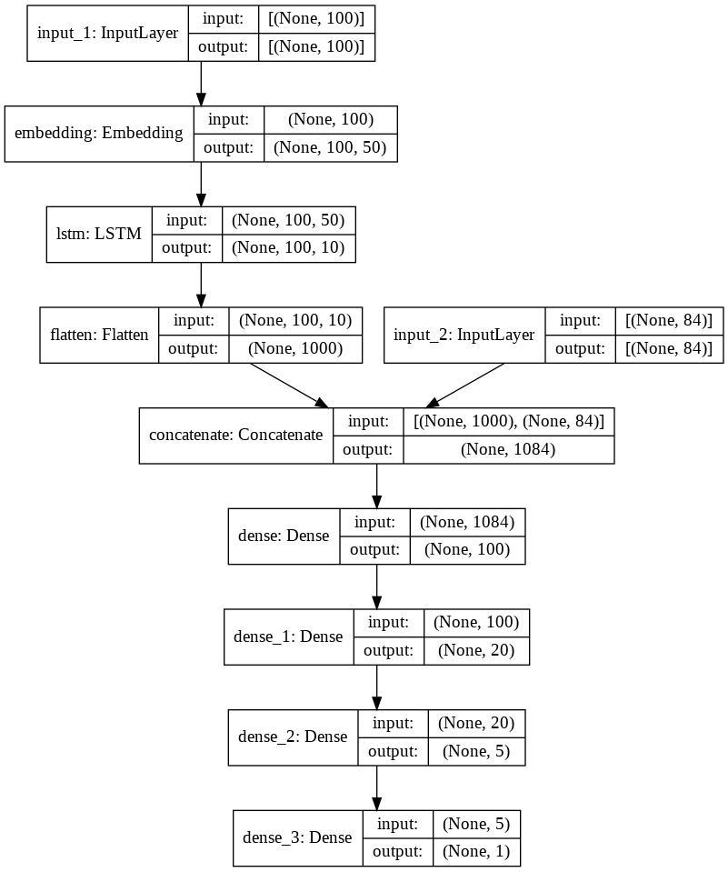
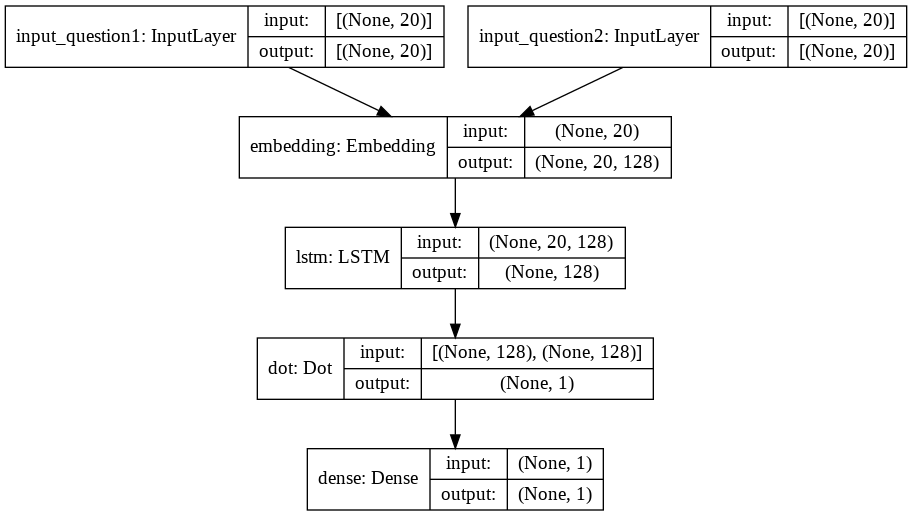

class: logo-slide

---

class: title-slide

### Recurrent Neural Networks

### Applications of Data Science - Class 18

### Giora Simchoni

#### `gsimchoni@gmail.com and add #dsapps in subject`

### Stat. and OR Department, TAU
### `r Sys.Date()`

---
```{r child = "../setup.Rmd"}
```

```{r packages, echo=FALSE, message=FALSE, warning=FALSE}
library(tidyverse)
library(emoji)
```

```{python, echo=FALSE, message=FALSE, warning=FALSE}
# Seed value (can actually be different for each attribution step)
seed_value= 0

# 1. Set `PYTHONHASHSEED` environment variable at a fixed value
import os
# os.environ["CUDA_VISIBLE_DEVICES"] = "-1" # To turn off GPU
os.environ['PYTHONHASHSEED']=str(seed_value)

# 2. Set `python` built-in pseudo-random generator at a fixed value
import random
random.seed(seed_value)

# 3. Set `numpy` pseudo-random generator at a fixed value
import numpy as np
np.random.seed(seed_value)

# 4. Set `tensorflow` pseudo-random generator at a fixed value
import tensorflow as tf
tf.random.set_seed(seed_value)

# 5. Configure a new global `tensorflow` session
# from keras import backend as K
# session_conf = tf.ConfigProto(intra_op_parallelism_threads=1, inter_op_parallelism_threads=1)
# sess = tf.Session(graph=tf.get_default_graph(), config=session_conf)
# K.set_session(sess)
```

class: section-slide

# Time keeps moving on
#### (Janis Joplin)

---

### What would Simone do next?


---

### What would be the price of GOOG tomorrow?

```{python, echo=FALSE, out.width="60%"}
import pandas as pd
import matplotlib.pyplot as plt

def plot_series(series, n_steps, y=None, y_pred=None, x_label="$t$", y_label="$x(t)$"):
  plt.figure(figsize=(10, 5))
  plt.plot(series, ".-")
  if y is not None:
      plt.plot(n_steps, y, "bx", markersize=10)
  if y_pred is not None:
      plt.plot(n_steps, y_pred, "ro")
  plt.grid(True)
  if x_label:
      plt.xlabel(x_label, fontsize=16)
  if y_label:
      plt.ylabel(y_label, fontsize=16, rotation=0)
  plt.hlines(0, 0, 100, linewidth=1)
  plt.axis([0, n_steps + 1, -1, 1])
```

```{python Google, out.width = "100%", fig.asp=0.5}
df = pd.read_csv("../data/fortune500_100_days.csv")
google = df[df['Fortune500'] == 'GOOG'].values[0][1:]
plot_series(google[:-1], 100, google[-1], y_label='')
plt.show()
```

---

### What is he going to say next?


---

class: section-slide

# Simple RNN

---

### The Setting

Suppose we have a univariate time series $(x_{i1}, x_{i2}, ..., x_{iT})$ of $T$ time steps, where $i = 1, ..., N$ (e.g. Fortune $N = 500$ stock price, the last $T = 100$ days), and we want to predict $y_i$, which could be:
- The next day price (regression setting)
- Positive or negative outcome (classification setting)
- Simone Biles next move (???)


.insight[
`r emoji("bulb")` What are the disadvantages of a regular network in this setting?
]

---

class: section-slide

# Detour: Time Series Analysis

---

### Don't invent the wheel!

Time Series Analysis is a big deal in Statistics.

.pull-left[



]

.pull-right[



]
---

class: section-slide

# End of Detour

---

### A Single Neuron RNN

The most basic Single-Neuron RNN would:
- take $x_t$, learn from it and output $\hat{y}_t$
- then take both the next input $x_{t+1}$ and previous output $\hat{y}_t$, learn from them
- by learning we mean forward and backward propagating at each stage with some loss $L$ (e.g. MSE)



---

### Unrolling a Neuron



.insight[
`r emoji("bulb")` But how many parameters are we actually learning?

What important NN principle is demonstrated here?
]

---

### If you build it, they will come.

Remember we built a Logistic Regression NN? Guess what!

At high level nothing changes!

```{python}
def single_rnn(X, y, epochs, alpha):
  w = np.array([1, 1, 1])
  ls = np.zeros(epochs)
  for i in range(epochs):
    l, w = optimize(X, y, alpha, w)
    ls[i] = l
  return ls, w

def optimize(X, y, alpha, w):
  y_pred_arr, l = forward(X, y, w)
  grad = backward(X, y, y_pred_arr, w)
  w = gradient_descent(alpha, w, grad)
  return l, w

def gradient_descent(alpha, w, grad):
  return w - alpha * grad
```

---

### Forward Propagation

$$\hat{y}_1 = \tanh(w_0 + w_1 \cdot x_1 + w2 \cdot y_{0}) \\
\vdots \\
\hat{y}_T = tanh(w_0 + w_1 \cdot x_T + w2 \cdot \hat{y}_{T - 1}) \\
L = MSE = \frac{1}{N}\sum_{i = 1}^{N}(y_{i} - \hat{y}_{iT})^2$$

```{python}
def forward(X, y, w):
  N, T = X.shape
  y_pred_arr = np.zeros((N, T + 1))
  y_pred = np.zeros(N)
  y_pred_arr[:, 0] = y_pred
  for t in range(T):
    y_pred = np.tanh(w[0] + X[:, t] * w[1] + y_pred * w[2])
    y_pred_arr[:, t + 1] = y_pred
  l = np.mean((y - y_pred)**2)
  return y_pred_arr, l
```

---

### Backward Propagation

$$\frac{\partial \hat{y}_{i1}}{\partial w_0} = \frac{\partial \tanh(o_{i1})}{\partial o_{i1}}\frac{\partial o_{i1}}{\partial w_0} = [1 - \tanh^2(o_{i1})] \cdot 1 = 1 - \hat{y}^2_{i1} \\
\frac{\partial \hat{y}_{i2}}{\partial w_0} = \frac{\partial \tanh(o_{i2})}{\partial o_{i2}}\frac{\partial o_{i2}}{\partial w_0} = (1 - \hat{y}^2_{i2})(1 + w_2\frac{\partial \hat{y}_{i1}}{\partial w_0})\\
\vdots \\
\frac{\partial L}{\partial w_0} = \sum_{i = 1}^N \frac{\partial L}{\partial \hat{y}_{iT}}\frac{\partial \hat{y}_{iT}}{\partial w_0} = \sum_{i = 1}^N -\frac{2}{N}(y_i - \hat{y}_{iT})\frac{\partial \tanh(o_{iT})}{\partial o_{iT}}\frac{\partial o_{iT}}{\partial w_0} = \\
= \sum_{i = 1}^N -\frac{2}{N}(y_i - \hat{y}_{iT})(1 - \hat{y}^2_{iT})[1 + w_2\frac{\partial \hat{y}_{iT-1}}{\partial w_0}]$$

And you are cordially invited to do the same for $\frac{\partial L}{\partial w_1}$ and $\frac{\partial L}{\partial w_2}$.

.font80percent[Hope you have as much fun as I did.]

---

```{python}
def backward_t(X, y_pred_arr, w, grads, t, N):
  y_t = y_pred_arr[:, t]
  if t == 0:
    grads_w0 = np.ones((N, ))
    grads_w1 = X[:, t]
    grads_w2 = y_t
  else:
    dot_dyprev = w[2]
    dyprev_doprev = 1 - y_t ** 2
    grads_w0 = np.ones(N) + dot_dyprev * dyprev_doprev * grads[:, 0]
    grads_w1 = X[:, t] + dot_dyprev * dyprev_doprev * grads[:, 1]
    grads_w2 = y_t + dot_dyprev * dyprev_doprev * grads[:, 2]
  return np.stack([grads_w0, grads_w1, grads_w2], axis=1)

def backward(X, y, y_pred_arr, w):
  N, T = X.shape
  y_pred = y_pred_arr[:, -1]
  dl_dypred = -2 * (y - y_pred) / N
  dypred_doT = 1 - y_pred ** 2
  grads =  np.zeros((N, 3))
  for t in range(T):
    grads = backward_t(X, y_pred_arr, w, grads, t, N)
  for j in range(3):
    grads[:, j] *= dl_dypred * dypred_doT
  final_grads = grads.sum(axis=0)
  return final_grads
```

---

### The Fortune500 Stocks

```{python Fortune-Example, out.width = "70%", fig.asp=0.5}
df = pd.read_csv("../data/fortune500_100_days.csv")
X = df.iloc[:, 1:].values
y = X[:, -1]
X = X[:, :-1]

plt.clf()
plot_series(X[1, :], 100, y[1], y_label="MMM")
plt.show()
```

---

### What would be a good MSE?

Predicting with the mean of $y$ (the 101st day mean stock price)
```{python}
np.mean((y - y.mean())**2)
```

Predicting with the last column of $X$ (the 100th day stock price)
```{python}
np.mean((y - X[:, -1])**2)
```

---

### Training with our neuron

```{python Loss-History, out.width = "60%"}
mses, w = single_rnn(X, y, epochs=1000, alpha=0.01)
print(w)

plt.plot(mses)
plt.ylabel('MSE-Loss'); plt.xlabel('Epoch')
plt.show()
```

---

```{python Scatter-Fit, out.width = "50%"}
y_pred_arr, mse = forward(X, y, w)
y_pred = y_pred_arr[:, -1]
print(mse)

plt.scatter(y, y_pred)
plt.ylabel('y_pred'); plt.xlabel('y_true')
plt.show()
```

.insight[
`r emoji("bulb")` Are you surprised? How could we easily improve?

What would be a better aproach for this simple dataset?
]

---

### Finally, Keras

```{python}
from tensorflow.keras import Sequential
from tensorflow.keras.layers import SimpleRNN
from tensorflow.keras.optimizers import Adam

model = Sequential([
  SimpleRNN(1, input_shape=(None, 1))
])
model.compile(optimizer=Adam(lr=0.01), loss='mse')

X = X[:, :, np.newaxis]
y = y[:, np.newaxis]

print(X.shape)
print(y.shape)

history = model.fit(X, y, epochs=50, verbose=0)
```

---

```{python, SingleNeuron-Loss, out.width="50%"}
print(model.get_weights()[2], model.get_weights()[0], model.get_weights()[1])
y_pred = model.predict(X, verbose=0)
print(np.mean((y - y_pred) **2))

plt.plot(history.history['loss'])
plt.show()
```

---

```{python, SingleNeuron-Scatter-Fit, out.width="50%"}
plt.scatter(y, y_pred)
plt.ylabel('y_pred'); plt.xlabel('y_true')
plt.show()
```

---

### Add inputs, Add neurons

$\hat{Y}_t = \tanh(W_0 + X_t \cdot W_1 + \hat{Y}_{t-1} \cdot W_2)$

- $X_t$ is $n$ batch size X $m$ inputs
- $W_1$ is $m$ inputs X $p$ neurons
- $\hat{Y}_t$ is $n$ batch size X $p$ neurons
- $W_2$ is $p$ neurons X $p$ neurons
- $W_0$ is $p$ X 1 bias vector



---

### Add layers

```{python}
model = Sequential([
  SimpleRNN(10, return_sequences=True, input_shape=[None, 1]),
  SimpleRNN(5, return_sequences=True),
  SimpleRNN(1)
])

model.compile(optimizer=Adam(lr=0.01), loss='mse')
```

---

```{python}
model.summary()
```

* 10 neurons each having: 1 inputs, 1 bias, all other 10 outputs in layer: 10 * (1 + 1 + 10)
* 5 neurons each having: 10 inputs, 1 bias, all other 5 outputs in layer: 5 * (10 + 1 + 5)
* 1 neurons each having: 5 inputs, 1 bias, all other 1 outputs in layer: 1 * (5 + 1 + 1)

---

```{python, DeepRNN-Scatter-Fit, out.width="50%"}
history = model.fit(X, y, epochs=30, verbose=0)

y_pred = model.predict(X, verbose=0)
print(np.mean((y - y_pred) **2))

plt.scatter(y, y_pred)
plt.ylabel('y_pred'); plt.xlabel('y_true')
plt.show()
```

.insight[
`r emoji("bulb")` Though ~200 params for predicting 500 numbers... sounds a bit much.
]

---

### Possibilities are endless



.font80percent[Source: [CS230](https://stanford.edu/~shervine/teaching/cs-230/cheatsheet-recurrent-neural-networks)]

---

class: section-slide

# Detour: Text is a Time Series!

---

#### But we first have to tokenize it

```{python}
from tensorflow.keras.preprocessing import text, sequence

sentences = [
  'I love Stats so much',
  'I love ML too',
  'I love DS',
  'I love NN'
]

tokenizer = text.Tokenizer(num_words = 10)
tokenizer.fit_on_texts(sentences)

print(tokenizer.word_counts)
print(tokenizer.word_index)
print(tokenizer.index_word)
```

---

#### Then make it a sequence

```{python}
text_sequences = tokenizer.texts_to_sequences(sentences)

print(text_sequences)

X = sequence.pad_sequences(text_sequences,
  padding='post', truncating='post', maxlen=4)

print(X)
```

---

#### Now we can embed it

```{python}
from tensorflow.keras.layers import Embedding

embed_layer = Embedding(input_dim= (10 + 1), output_dim=3)

print(embed_layer(np.array([1])))

X_embedded = embed_layer(X)

print(X_embedded.shape)
print(X_embedded)
```

---

class: section-slide

# End of Detour

---

### Yelp!

~600K (!) [text reviews](https://www.tensorflow.org/datasets/catalog/yelp_polarity_reviews) of shops and restaurants, polarized to negative (1-2 stars) and positive (3-4 stars), 560K in training set.

```{python, eval=FALSE}
(ds_train, ds_test), ds_info = tfds.load('yelp_polarity_reviews',
  split=['train', 'test'], with_info=True)
  
df_train = tfds.as_dataframe(ds_train, ds_info)
df_test = tfds.as_dataframe(ds_test, ds_info)
df_test['text'] = df_test['text'].str.decode('utf-8')
df_train['text'] = df_train['text'].str.decode('utf-8')

print(df_train.shape)
print(df_test.shape)
print(df_test.head(3))
```

```{python, echo=FALSE}
df_test = pd.read_csv('../data/yelp_polarity_reviews_test.csv')

print((560000, 2))
print(df_test.shape)
print(df_test.head(3))
```

---

#### Yelp! But with sequences

```{python, eval=FALSE}
from sklearn.model_selection import train_test_split

max_features = 10000
seq_len = 100

tokenizer = text.Tokenizer(num_words=max_features)
tokenizer.fit_on_texts(df_train['text'])
text_sequences = tokenizer.texts_to_sequences(df_train['text'])
X = sequence.pad_sequences(text_sequences, padding='post',
  truncating='post', maxlen=seq_len)

X_train, X_test, y_train, y_test = train_test_split(X,
  df_train['label'], test_size = 0.2)

print(X_train.shape)
print(X_test.shape)
```

```{python, echo=FALSE}
max_features = 10000
seq_len = 100
print((448000, 100))
print((112000, 100))
```

In case you're wondering, yes, there are smarter text generators, but even this 0.5M rows `X` matrix is only ~220MB.

---

#### Yelp with MLP

Remember there's nothing preventing you from using a simple NN, for (almost) everything:

```{python}
from tensorflow.keras.layers import Dense
from tensorflow.keras.callbacks import EarlyStopping

n_cells = 10
epochs = 100
batch_size = 30
words_embed_dim = 50
callbacks = EarlyStopping(monitor='val_loss', patience=5)

mlp = Sequential([
  Embedding(max_features + 1, words_embed_dim),
  Dense(n_cells, activation='relu'),
  Dense(1, activation='sigmoid')
])

mlp.compile(loss = 'binary_crossentropy',
  optimizer='adam', metrics='accuracy')
```

---

```{python}
mlp.summary()
```

```{python, eval=FALSE}
history = mlp.fit(X_train, y_train, validation_split=0.1, callbacks=callbacks,
  batch_size=batch_size, epochs=epochs)
  
mlp.evaluate(X_test, y_test)
```

```{python, echo=FALSE}
print([0.6664084792137146, 0.5871875286102295])
```

---

#### Yelp with RNN

```{python}
rnn = Sequential([
  Embedding(max_features + 1, words_embed_dim),
  SimpleRNN(n_cells, return_sequences=True),
  SimpleRNN(1, activation='sigmoid')
])

rnn.compile(loss = 'binary_crossentropy',
  optimizer='adam', metrics='accuracy')

rnn.summary()
```

---

```{python, eval=FALSE}
history = rnn.fit(X_train, y_train, validation_split=0.1, callbacks=callbacks,
  batch_size=batch_size, epochs=epochs)
  
rnn.evaluate(X_test, y_test)
```

```{python, echo=FALSE}
print([0.44967198371887207, 0.8164107203483582])
```

---

class: section-slide

# 1D Convolution Layers

---

### If you got it in 2D...



Or, in a formula:
$Z_{i} = b + \sum_{v=0}^{f_w-1}X_{i - \frac{f_w - 1}{2} + v} \cdot W_{v}$

Or, in Numpy:

```{python}
np.convolve([0,1,2,1,0], [0.2,0.6,0.2][::-1], 'same')
```

.insight[
`r emoji("bulb")` Why would we want this?
]

---

```{python}
from tensorflow.keras.layers import Conv1D

rnn_conv1d = Sequential([
  Embedding(max_features + 1, words_embed_dim),
  Conv1D(filters=5, kernel_size=2, strides=1),
  SimpleRNN(n_cells, return_sequences=True),
  SimpleRNN(1, activation='sigmoid')
])

rnn_conv1d.compile(loss = 'binary_crossentropy',
  optimizer='adam', metrics='accuracy')

rnn_conv1d.summary()
```

---

```{python, eval=FALSE}
history = rnn_conv1d.fit(X_train, y_train, validation_split=0.1, callbacks=callbacks,
  batch_size=batch_size, epochs=epochs)
  
rnn_conv1d.evaluate(X_test, y_test)
```

```{python, echo=FALSE}
print([0.4487762749195099, 0.825705349445343])
```

---

class: section-slide

# LSTM

---

### RNN Cell has Short Memory

> I hated this bar, though the bartender was so handsome and the drink he made me was absolutely delicious.

The RNN sees `[I, hated, this, bar, ..., so, handsome, ... absolutely, delicious]`.

What do you think it would predict?

Enter Long Short-Term Memory cells (LSTM).

LSTM keeps track of its memory, of its state $C_t$, by constantly updating how much it needs to:
- forget from previous state: $f_t \cdot C_{t-1}$
- remember from current "candidate" state: $i_t \cdot \tilde{C_t}$

$C_t = f_t \cdot C_{t-1} + i_t \cdot \tilde{C_t}$

---

$C_t = f_t \cdot C_{t-1} + i_t \cdot \tilde{C_t}$

Where $i_t$ and $f_t$ are "gates" between 0 and 1.

Finally, the state goes through $\tanh()$ activation and another 0-1 gate $o_t$, and the output is:

$\hat{Y}_t = o_t \cdot tanh(C_t)$

So how do we learn the gates and get $\tilde{C_t}$? Don't panic:

$f_t = \sigma(W_{0f} + X_t \cdot W_{1f} + \hat{Y}_{t-1} \cdot W_{2f})$
$i_t = \sigma(W_{0i} + X_t \cdot W_{1i} + \hat{Y}_{t-1} \cdot W_{2i})$
$o_t = \sigma(W_{0o} + X_t \cdot W_{1o} + \hat{Y}_{t-1} \cdot W_{2o})$

$\tilde{C}_t = \tanh(W_{0c} + X_t \cdot W_{1c} + \hat{Y}_{t-1} \cdot W_{2c})$

Where $\sigma$ is the sigmoid function, shrinking any input to be between 0 and 1.

---

#### Or if you prefer a diagram


---

#### Yelp with LSTM

```{python, warning=FALSE, message=FALSE}
from tensorflow.keras.layers import LSTM

lstm = Sequential([
  Embedding(max_features + 1, words_embed_dim),
  LSTM(n_cells, return_sequences=True),
  LSTM(1, activation='sigmoid')
])

lstm.compile(loss = 'binary_crossentropy',
  optimizer='adam', metrics='accuracy')
```

.insight[
`r emoji("bulb")` So if RNN layer would have $l$ parameters, LSTM would have...?
]

---

```{python}
lstm.summary()
```

```{python, eval=FALSE}
history = lstm.fit(X_train, y_train, validation_split=0.1, callbacks=callbacks,
  batch_size=batch_size, epochs=epochs)
  
lstm.evaluate(X_test, y_test)
```

```{python, echo=FALSE}
print([0.22240985929965973, 0.9227678775787354])
```

---

### Beyond the black box

Sending "probes" can help us get what the LSTM is doing. By standardizing an LSTM neuron output to 0-1 and translating this to a cold-hot palette as was done [here](https://towardsdatascience.com/visualising-lstm-activations-in-keras-b50206da96ff) we can see what turns it on/off.

Here I checked the first neuron for a few test reviews (see full notebook in Colab):



---

### Play with it!

For example, combining LSTM with the old MLP to predict women's shoes price:



---

### Quora!

The [Quora Question Pairs](https://www.kaggle.com/c/quora-question-pairs) dataset has over 400K pairs of questions labeled for whether they're duplicate or not:

```{python}
quora_df = pd.read_csv('../data/quora_small.csv')

quora_df[['question1', 'question2', 'is_duplicate']].head()

quora_df['is_duplicate'].mean()
```

---

### Siamese Recurrent Architecture

Deciding whether two "things" are the same or not is a challenge to any ML system. NN are a great framework for this kind of task through a Siamese architecture, and LSTMs are great for text. We're following RStudio's [AI Blog](https://blogs.rstudio.com/ai/posts/2018-01-09-keras-duplicate-questions-quora/).



---

```{python}
from tensorflow.keras import Model
from tensorflow.keras.layers import Dot, Input
from tensorflow.keras.regularizers import l2

max_features = 50000
tokenizer = text.Tokenizer(num_words=max_features)
tokenizer.fit_on_texts(quora_df['question1'].append(quora_df['question2']).unique())

question1 = tokenizer.texts_to_sequences(quora_df['question1'])
question2 = tokenizer.texts_to_sequences(quora_df['question2'])

seq_len = 20
question1_padded = sequence.pad_sequences(question1, maxlen=seq_len, value = max_features + 1)
question2_padded = sequence.pad_sequences(question2, maxlen=seq_len, value = max_features + 1)

input1 = Input(shape = (seq_len,), name = "input_question1")
input2 = Input(shape = (seq_len, ), name = "input_question2")

word_embedder = Embedding( 
  input_dim = max_features + 2, output_dim = 128,
  input_length = seq_len,
  embeddings_regularizer = l2(0.0001)
)

seq_embedder = LSTM(units = 128,
  kernel_regularizer = l2(0.0001)
)
```

---

```{python}
vector1 = seq_embedder(word_embedder(input1))
vector2 = seq_embedder(word_embedder(input2))

cosine_similarity = Dot(axes=1)([vector1, vector2])

output = Dense(1, activation = 'sigmoid')(cosine_similarity)

model = Model(inputs = [input1, input2], outputs = output)
model.compile(optimizer = 'adam', loss = 'binary_crossentropy', metrics = 'accuracy')
```


```{python, eval=FALSE}
# messy print, see notebook in Colab
model.summary()
```

---

```{python, eval=FALSE}
train_sample, val_sample = train_test_split(quora_df.index, test_size=0.1)

train_question1_padded = question1_padded[train_sample,]
train_question2_padded = question2_padded[train_sample,]
train_is_duplicate = quora_df['is_duplicate'][train_sample]

val_question1_padded = question1_padded[val_sample,]
val_question2_padded = question2_padded[val_sample,]
val_is_duplicate = quora_df['is_duplicate'][val_sample]

history = model.fit(
  [train_question1_padded, train_question2_padded],
  train_is_duplicate, 
  batch_size = 64, 
  epochs = 100,
  callbacks = [EarlyStopping(monitor='val_loss', patience=5, restore_best_weights=True)],
  validation_data = ([val_question1_padded, val_question2_padded], val_is_duplicate)
)

model.evaluate(([val_question1_padded, val_question2_padded], val_is_duplicate))
```

```{python, echo=FALSE}
print([0.43971124291419983, 0.8325954079627991])
```

---

Save the model, put this function in the most basic Shiny/Dash app, and...

```{python, eval=FALSE}
def predict_question_pairs(model, tokenizer, q1, q2):
    q1 = tokenizer.texts_to_sequences([q1])
    q2 = tokenizer.texts_to_sequences([q2])

    q1 = sequence.pad_sequences(q1, maxlen=seq_len, value = max_features + 1)
    q2 = sequence.pad_sequences(q2, maxlen=seq_len, value = max_features + 1)

    return model.predict([q1, q2])[0][0]

predict_question_pairs(
  model,
  tokenizer,
  "What does a LSTM do?",
  "How does a LSTM work?"
)
```

```{python, echo=FALSE}
print(0.5638776)
```
