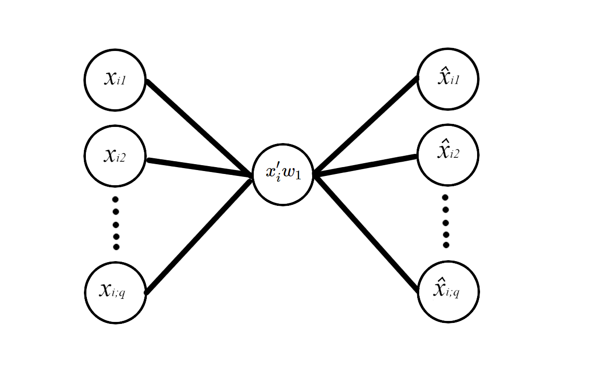
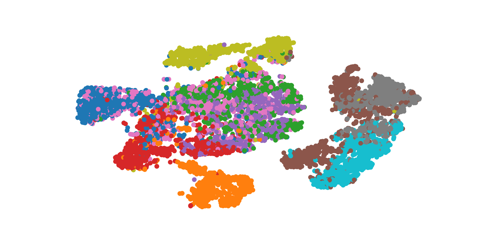
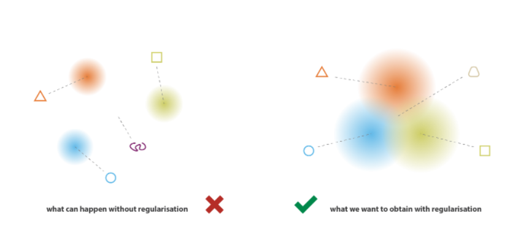

class: logo-slide

---

class: title-slide

### Intro to Autoencoders

### Applications of Data Science - Class 19

### Giora Simchoni

#### `gsimchoni@gmail.com and add #dsapps in subject`

### Stat. and OR Department, TAU
### `r Sys.Date()`

---
```{r child = "../setup.Rmd"}
```

```{r packages, echo=FALSE, message=FALSE, warning=FALSE}
library(tidyverse)
library(emoji)
```

```{python, echo=FALSE, message=FALSE, warning=FALSE}
# Seed value (can actually be different for each attribution step)
seed_value= 0

# 1. Set `PYTHONHASHSEED` environment variable at a fixed value
import os
os.environ['PYTHONHASHSEED']=str(seed_value)

# 2. Set `python` built-in pseudo-random generator at a fixed value
import random
random.seed(seed_value)

# 3. Set `numpy` pseudo-random generator at a fixed value
import numpy as np
np.random.seed(seed_value)

# 4. Set `tensorflow` pseudo-random generator at a fixed value
import tensorflow as tf
tf.random.set_seed(seed_value)

# 5. Configure a new global `tensorflow` session
# from keras import backend as K
# session_conf = tf.ConfigProto(intra_op_parallelism_threads=1, inter_op_parallelism_threads=1)
# sess = tf.Session(graph=tf.get_default_graph(), config=session_conf)
# K.set_session(sess)

import matplotlib.pyplot as plt
```

class: section-slide

# Stacked Autoencoders (SAE)

#### (Heavily inspired by Geron 2019)

---

### Remember me? `r emoji("cry")`

$\max_{w_1}{w'_1X'Xw_1} \text{ s.t.} ||w_1|| = 1$

PCA is a linear encoder. Sort of.



---

### NN "PCA"

```{python, echo=FALSE}
def generate_3d_data(m, w1=0.1, w2=0.3, noise=0.1):
    angles = np.random.rand(m) * 3 * np.pi / 2 - 0.5
    data = np.empty((m, 3))
    data[:, 0] = np.cos(angles) + np.sin(angles)/2 + noise * np.random.randn(m) / 2
    data[:, 1] = np.sin(angles) * 0.7 + noise * np.random.randn(m) / 2
    data[:, 2] = data[:, 0] * w1 + data[:, 1] * w2 + noise * np.random.randn(m)
    return data
```
```{python}
X_train = generate_3d_data(60)
X_train = X_train - X_train.mean(axis=0, keepdims=0)
```

```{python 3D-data, echo=FALSE, out.width="60%"}
fig = plt.figure()
ax = fig.add_subplot(projection='3d')
ax.scatter(X_train[:,0], X_train[:,1], X_train[:,2], marker='o')
ax.set_xlabel("$x_1$", fontsize=18)
ax.set_ylabel("$x_2$", fontsize=18)
ax.set_zlabel("$x_3$", fontsize=18)
plt.show()
```

---

```{python, eval=FALSE, echo=FALSE}
np.random.seed(42)
tf.random.set_seed(42)
```

```{python}
from sklearn.decomposition import PCA

pca = PCA(n_components=2)
pca.fit(X_train)
```

```{python}
from tensorflow.keras import Sequential
from tensorflow.keras.layers import Dense, Flatten, Reshape

encoder = Sequential([Dense(2, input_shape=[3])])
decoder = Sequential([Dense(3, input_shape=[2])])
autoencoder = Sequential([encoder, decoder])

autoencoder.compile(loss='mse', optimizer='adam')

history = autoencoder.fit(X_train, X_train, epochs=20, verbose=0) #<<
```

```{python}
codings = encoder.predict(X_train)
pcs = pca.transform(X_train)

print(f'codings shape: {codings.shape}, pcs shape: {pcs.shape}')
```

---

How did NN "PCA" do?

```{python PCs-comparison0, out.width="50%"}
plt.scatter(codings[:,0], codings[:, 1])
plt.xlabel("$'PC'_1$", fontsize=18)
plt.ylabel("$'PC'_2$", fontsize=18, rotation=0)
plt.show()
```

---

Is it PCA though?

```{python, eval=FALSE}
plt.scatter(pcs[:, 0], codings[:, 0])
plt.show()
```

```{python PCs-comparison1, echo=FALSE, out.width="50%"}
plt.scatter(pcs[:, 0], codings[:, 0])
plt.xlabel("$PC_1$", fontsize=18)
plt.ylabel("$'PC'_1$", fontsize=18, rotation=0)
plt.show()
```

---

Is it PCA though?

```{python, eval=FALSE}
plt.scatter(pcs[:, 1], codings[:, 1])
plt.show()
```

```{python PCs-comparison2, echo=FALSE, out.width="50%"}
plt.scatter(pcs[:, 1], codings[:, 1])
plt.xlabel("$PC_2$", fontsize=18)
plt.ylabel("$'PC'_2$", fontsize=18, rotation=0)
plt.show()
```

.insight[
`r emoji("bulb")` Can you make it PCA?
]

---

Will non-linearity help?

```{python}
encoder = Sequential([Dense(20, input_shape=[3], activation='relu'),
  Dense(2)])
decoder = Sequential([Dense(20, input_shape=[2], activation='relu'),
  Dense(3)])
autoencoder = Sequential([encoder, decoder])
autoencoder.compile(loss='mse', optimizer='adam')
history = autoencoder.fit(X_train, X_train, epochs=20, verbose=0)
```

```{python PCs-comparison3, echo=FALSE, out.width="50%"}
codings = encoder.predict(X_train)
plt.scatter(codings[:,0], codings[:, 1])
plt.xlabel("$'PC'_1$", fontsize=18)
plt.ylabel("$'PC'_2$", fontsize=18, rotation=0)
plt.show()
```

---

### Stacked Autoencoders

Stacked autoencoders have been around for NLPCA for over 30 years (see e.g. [Kramer 1991](https://aiche.onlinelibrary.wiley.com/doi/abs/10.1002/aic.690370209)).


---

### SAE on FNIST

```{python, echo=FALSE}
from tensorflow.keras.datasets import fashion_mnist
from tensorflow.keras.models import load_model

(X_train, y_train), (X_test, y_test) = fashion_mnist.load_data()
X_train = X_train.astype(np.float32) / 255
X_test = X_test.astype(np.float32) / 255

stacked_ae = load_model('models/stacked_ae.h5', compile=False)
stacked_encoder = load_model('models/stacked_encoder.h5', compile=False)
stacked_decoder = load_model('models/stacked_decoder.h5', compile=False)
```

```{python, eval=FALSE}
from tensorflow.keras.datasets import fashion_mnist

(X_train, y_train), (X_test, y_test) = fashion_mnist.load_data()
X_train = X_train.astype(np.float32) / 255
X_test = X_test.astype(np.float32) / 255

stacked_encoder = Sequential([
    Flatten(input_shape=[28, 28]),
    Dense(100, activation="relu"),
    Dense(30, activation="relu"),
])
stacked_decoder = Sequential([
    Dense(100, activation="relu", input_shape=[30]),
    Dense(28 * 28, activation="sigmoid"),
    Reshape([28, 28])
])
stacked_ae = Sequential([stacked_encoder, stacked_decoder])

stacked_ae.compile(loss='mse', optimizer='adam')

history = stacked_ae.fit(X_train, X_train, epochs=20, verbose=1)
```

---

Can it reconstruct?

```{python SAE-recon, out.width="80%"}
def show_reconstructions(sae, images, n_images=5):
  reconstructions = sae.predict(images[:n_images])
  fig = plt.figure(figsize=(n_images * 1.5, 3))
  for image_index in range(n_images):
      plt.subplot(2, n_images, 1 + image_index)
      plt.imshow(images[image_index], cmap="binary")
      plt.axis("off")
      plt.subplot(2, n_images, 1 + n_images + image_index)
      plt.imshow(reconstructions[image_index], cmap="binary")
      plt.axis("off")

show_reconstructions(stacked_ae, X_test)
plt.show()
```

---

Can it "denoise"?

```{python}
shoe_encoded = stacked_encoder.predict(X_test[np.newaxis, 0,:])
shoe_encoded
```

```{python}
shoe1 = stacked_decoder.predict(shoe_encoded)[0]
shoe2 = stacked_decoder.predict(shoe_encoded +np.random.normal(scale=1))[0]
shoe3 = stacked_decoder.predict(shoe_encoded +np.random.normal(scale=5))[0]
```

---

```{python Shoe-decoded, out.width = "80%"}
fig, axes = plt.subplots(1, 3, figsize=(6, 3))
axes[0].imshow(shoe1, cmap="binary")
axes[1].imshow(shoe2, cmap="binary")
axes[2].imshow(shoe3, cmap="binary")
_ = axes[0].axis('off')
_ = axes[1].axis('off')
_ = axes[2].axis('off')
plt.show()
```

---

Can it average?

```{python Mean-decoded, out.width = "80%"}
shirt_encoded = stacked_encoder.predict(X_test[np.newaxis, 1,:])
mean_encoded = (shoe_encoded + shirt_encoded) / 2

fig, axes = plt.subplots(1, 3, figsize=(6, 3))
_ = axes[0].imshow(X_test[0,:], cmap="binary")
_ = axes[1].imshow(X_test[1,:], cmap="binary")
_ = axes[2].imshow(stacked_decoder.predict(mean_encoded)[0], cmap="binary")
_ = axes[0].axis('off')
_ = axes[1].axis('off')
_ = axes[2].axis('off')
plt.show()
```

---

Can it **generate**?

```{python Random-decoded, out.width = "80%"}
X_test_compressed = stacked_encoder.predict(X_test)
mins = X_test_compressed.min(axis=0)
maxs = X_test_compressed.max(axis=0)

_ = plt.imshow(stacked_decoder.predict(
  np.random.uniform(mins, maxs, size=30)[np.newaxis, :]
  )[0], cmap="binary")
_ = plt.axis('off')
plt.show()
```

---

class: section-slide

# Variational Autoencoders (VAE)

---

How does SAE latent space look like?

```{python SAE-TSNE, eval=FALSE, out.width = "50%"}
from sklearn.manifold import TSNE

tsne = TSNE()
X_test_2D = tsne.fit_transform(X_test_compressed)
X_test_2D = (X_test_2D - X_test_2D.min()) / (X_test_2D.max() - X_test_2D.min())

_ = plt.scatter(X_test_2D[:, 0], X_test_2D[:, 1], c=y_test, s=10, cmap='tab10')
_ = plt.axis('off')
plt.show()
```



---

### Road to VAE

* The latent space has many "holes", it is "irregular"
* If we sample from these areas and decode, we cannot expect to get a meaningful element in the input space, result would be **unlikely**
* And why should we? Reconstruction loss is "king", it is overfitting! We not to regularize.



.font80percent[Source: [Rocca 2019](https://towardsdatascience.com/understanding-variational-autoencoders-vaes-f70510919f73)]

---

### Road to VAE

In a landmark paper, [Kingma & Welling (2013)](https://arxiv.org/abs/1312.6114) suggest:

* Suppose there's a latent variable (LV) $z$
* The **probabilistic** encoder is defined by $p(z|x)$
* The **probabilistic** decoder is defined by $p(x|z)$
* Make $p(z)$, the prior of the LV, $N(0, I)$ - so the posterior encoder $p(z|x)$ cannot "run away"
* Make $p(x|z)$ be $N(f_{\theta}(z), \sigma^2I)$ where $f$ would be modeled by DNN

* Goal: make the $x$'s produced by the decoder **likely**, i.e. maximize the marginal likelihood: $p(x) = \int p(x|z)p(z)dz$

But what is the posterior $p(z|x)$?

---

### Variational Inference (VI)

* A technique to approximate complex distributions (posteriors)
* Set a parametrised family of distribution $q(z)$ (for example the family of Gaussians)
* Look for the best approximation of our target distribution among this family: $q(z) \approx p(z|x)$
* The best element in the family is one that minimizes: $D_{KL}(q(z)||p(z|x)) = \int q(z) \log \frac{q(z)}{p(z|x)}$ 
* Mark $q$ as $q(z|x)$, so that this "family" would be $N(g_{\eta}(x), h_{\psi}(x))$
* This is how it will depend on the data $x$, and $g, h$ will be found with the encoder network, minimizing the KL loss

---

Now dig this:

$$
\begin{align}
D_{KL}(q(z|x)||p(z|x)) &= \int q(z|x) \log \frac{q(z|x)}{p(z|x)} \\ 
&= E_q[\log(q(z|x)) - \log(p(z|x))] \\
&= E_q[\log(q(z|x)) - \log \frac{p(z)p(x|z)}{p(x)}] \\
&= E_q[\log(q(z|x)) - \log(p(z))] \\
& - E_q[\log(p(x|z))] + \log(p(x)) \\
&= D_{KL}(q(z|x) || p(z)) - E_q[\log(p(x|z))] + \log(p(x))
\end{align}
$$

But we want to maximize $p(x)$!

---

When writing

$$
\log(p(x)) - D_{KL}(q(z|x)||p(z|x)) = E_q[\log(p(x|z))] - D_{KL}(q(z|x) || p(z)),
$$

we see that maximizing log-likelihood $\log(p(x))$ combined with minimizing KL-divergence $D_{KL}(q(z|x)||p(z|x))$ boils down to maximizing the RHS or maximizing the **Evidence Lower BOund**:

$$
ELBO(\theta, \eta, \psi|X) = E_q[\log(p(x|z))] - D_{KL}(q(z|x) || p(z))
$$

Which is called like this since $D_{KL} \ge 0$ always, so $log(p(x)) \ge ELBO$, it is an "evidence lower bound".

Turning this to a loss function we need to minimize: 

$$
-ELBO(\theta_f, \theta_g, \theta_h|X) = -E_q[\log(p(x|z))] + D_{KL}(q(z|x) || p(z))
$$

---
